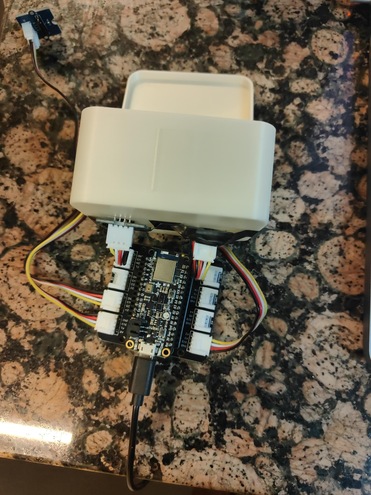
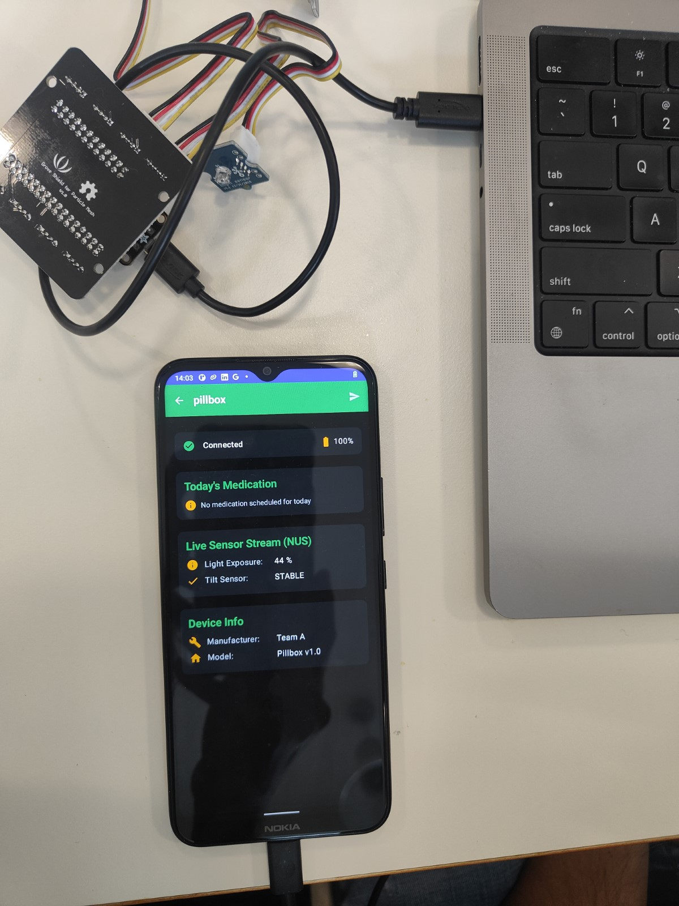

<div align="center">

# 💊 Smart Pillbox System

**An IoT-powered medication adherence tracker**

*MSE TSM MobCom — Project A | HS 2025*

[](https://kotlinlang.org)
[](https://developer.android.com/jetpack/compose)
[](https://www.arduino.cc)
[](https://www.bluetooth.com)

</div>

---

## 📋 Overview

The **Smart Pillbox** is an end-to-end IoT system that helps patients stick to their medication schedules. A sensor-equipped pillbox detects when the lid is opened and a pill is removed, then sends real-time updates to a companion Android app via Bluetooth Low Energy (BLE).

### How It Works

```
┌──────────────┐       BLE        ┌──────────────────┐
│   Pillbox    │ ───────────────► │   Android App    │
│  (Arduino)   │   GATT Notify   │  (Jetpack Compose)│
│              │                  │                   │
│ • 2× Light   │                  │ • Live dashboard  │
│ • 1× Tilt    │                  │ • Schedule mgmt   │
│              │                  │ • History & stats  │
└──────────────┘                  │ • Notifications    │
                                  └──────────────────┘
```

When the pillbox lid opens, light sensors detect the change and the tilt sensor confirms physical handling. The Android app receives these events, matches them against the medication schedule, and logs the result — all without internet access.

---

## 📸 Demo

<div align="center">

&nbsp;&nbsp;&nbsp;

<br/><br/>
<em>Left: The Smart Pillbox hardware (Adafruit Feather nRF52840 + Grove sensors) · Right: Android companion app showing live sensor data via BLE</em>
</div>

---

## ✨ Features

| Category | Details |
|---|---|
| **Pill Detection** | Automatic detection via combined light + tilt sensor thresholds |
| **Medication Schedule** | Set daily reminders with day-of-week selection and time picker |
| **Live Dashboard** | Real-time sensor readings, connection status, and next-dose countdown |
| **History & Analytics** | Consumption records, compliance percentage, and streak tracking |
| **Notifications** | Reminder alerts at scheduled time; missed-dose alerts after 1-hour grace |
| **Manual Override** | "Mark as Taken" button for manual consumption logging |
| **Theming** | Light / Dark / System-default theme |

---

## 🏗 Architecture

The system follows an **IoT Gateway** reference model with three layers:

| Layer | Technology | Role |
|---|---|---|
| **Perception** | Adafruit Feather nRF52840 + Grove sensors | Read physical sensor data |
| **Network** | Bluetooth Low Energy (GATT) | Low-power wireless communication |
| **Application** | Android (Kotlin, Jetpack Compose) | Gateway, UI, scheduling, storage |

The Android app uses **Clean Architecture** with **MVVM** (ViewModel + Repository + Room Database).

> 📊 See [`docs/diagrams.md`](docs/diagrams.md) for full Mermaid diagrams (system architecture, class diagram, sequence diagram, BLE schema, and Arduino flowchart).

---

## 📁 Repository Structure

```
.
├── android/                    # Android companion app
│   ├── app/src/main/java/      #   Kotlin source (BLE, DB, UI, ViewModels)
│   ├── build.gradle.kts        #   Gradle build config
│   └── README.md               #   Android-specific documentation
│
├── arduino/                    # Arduino firmware
│   ├── UartBlePeripheral_Light_Tilt/   # Main BLE peripheral sketch
│   ├── LightSensorTest/        #   Light sensor test sketch
│   ├── TiltSensorTest/         #   Tilt sensor test sketch
│   └── README.md               #   Hardware & firmware documentation
│
├── docs/                       # Documentation
│   ├── diagrams.md             #   Mermaid diagrams (architecture, class, sequence, BLE)
│   └── report.md               #   Project report
│
├── .gitignore
└── README.md                   # ← You are here
```

---

## 🚀 Getting Started

### Prerequisites

| Tool | Version |
|---|---|
| [Android Studio](https://developer.android.com/studio) | Latest stable |
| [Arduino IDE](https://www.arduino.cc/en/software/) | 2.x |
| Android device | API 23+, BLE capable |
| Adafruit Feather nRF52840 | — |

### 1. Flash the Arduino firmware

```bash
# Open arduino/UartBlePeripheral_Light_Tilt/ in Arduino IDE
# Select Board: Adafruit Feather nRF52840 Sense
# Upload
```

### 2. Build & run the Android app

```bash
# Open android/ in Android Studio
# Sync Gradle → Run 'app' on a connected device
```

> For detailed setup, see [`android/README.md`](android/README.md) and [`arduino/README.md`](arduino/README.md).

---

## 📡 BLE Interface

Custom GATT service for sensor data:

| Characteristic | UUID | Data |
|---|---|---|
| **Pillbox Service** | `0000AB00-B5A3-F393-E0A9-E50E24DCCA9E` | Primary Service |
| Light Sensor #1 | `0000AB01-...` | `uint8` 0–100 % (Notify/Read) |
| Light Sensor #2 | `0000AB02-...` | `uint8` 0–100 % (Notify/Read) |
| Tilt Sensor | `0000AB03-...` | `uint8` 0 or 1 (Notify/Read) |

---

## 👥 Team

| Name | GitHub |
|---|---|
| Vikas Chaurasia | [@vkas-chaurasia](https://github.com/vkas-chaurasia) |
| Sai Kiran Sabavath | [@skiran017](https://github.com/skiran017) |
| Jonathan Müller | [@JonnyTheCattest](https://github.com/JonnyTheCattest) |

---

## 📄 License

This project was developed as part of the **MSE TSM Mobile Computing** module at [ZHAW](https://www.zhaw.ch/).
