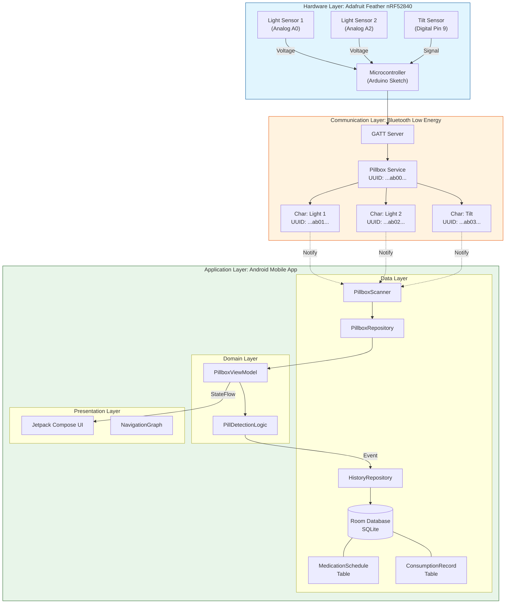
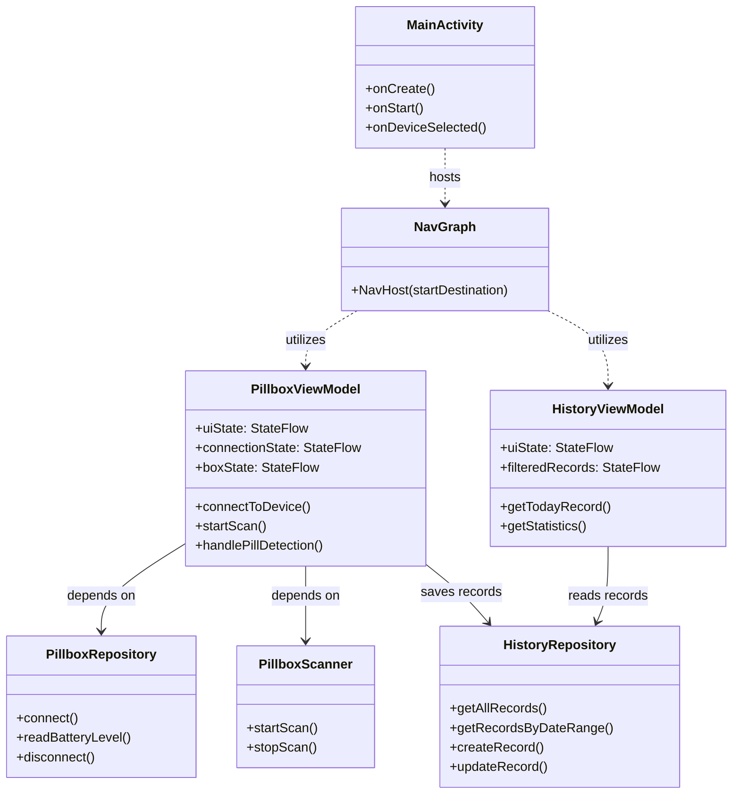
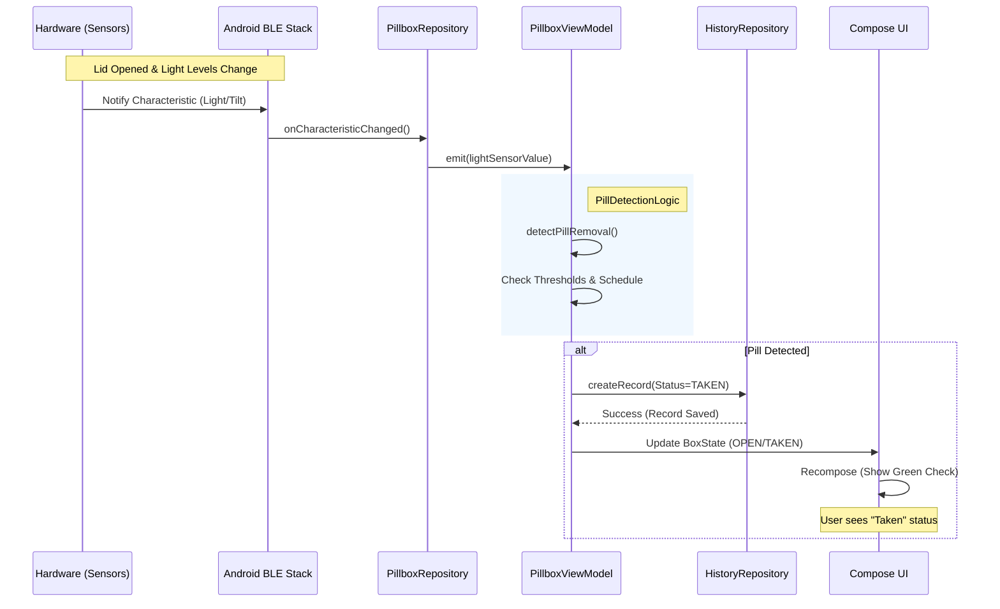
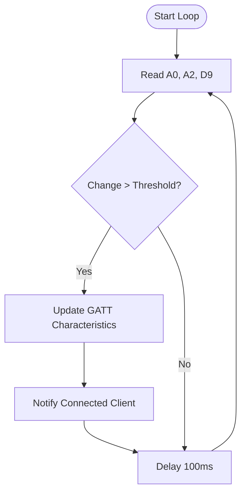
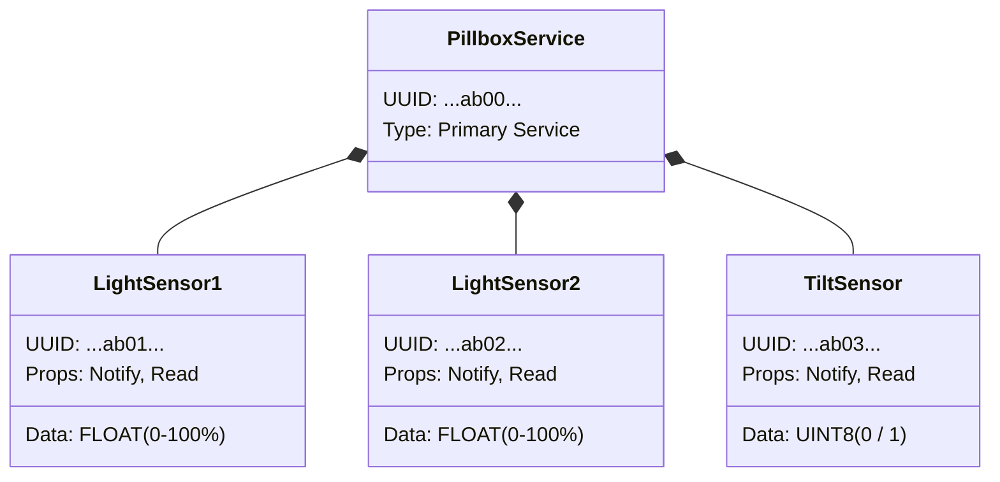

# Mermaid Diagram Source Code

## 1. Full System Architecture (C4 Style)
Use this structure to visualize the Hardware, ALE, and Android layers.
Copy and paste into [Mermaid Live](https://mermaid.live/).

## 2. Detailed Class Diagram

## 3. Sequence Diagram: Pill Taken Event

## 4. Arduino Logic Flowchart

## 5. BLE GATT Services & Characteristics Schema

